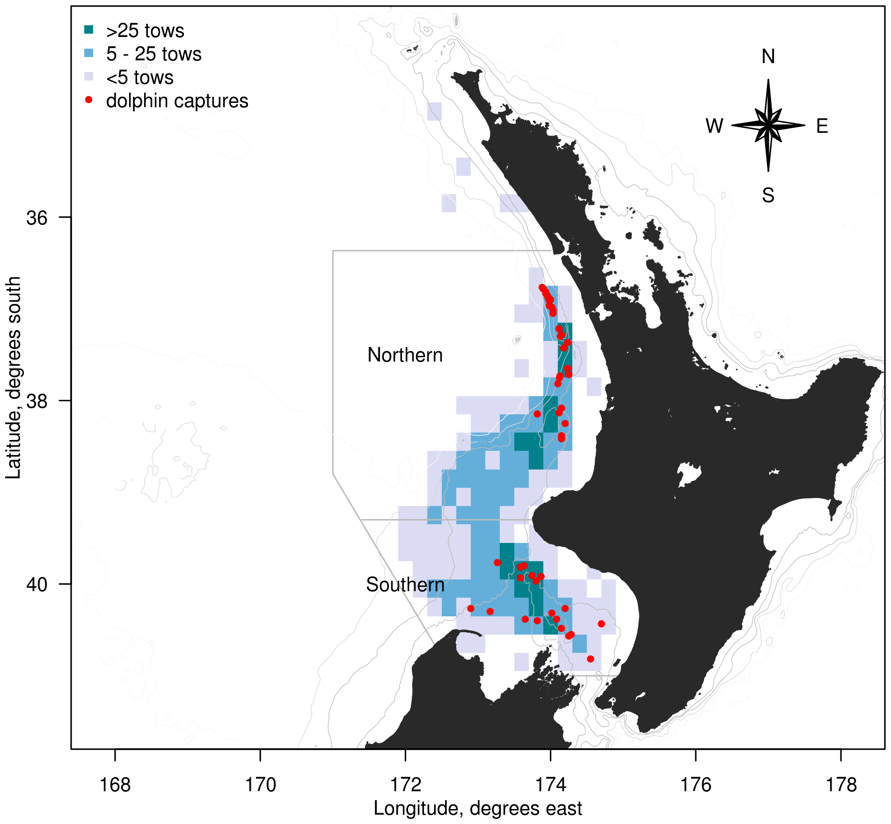
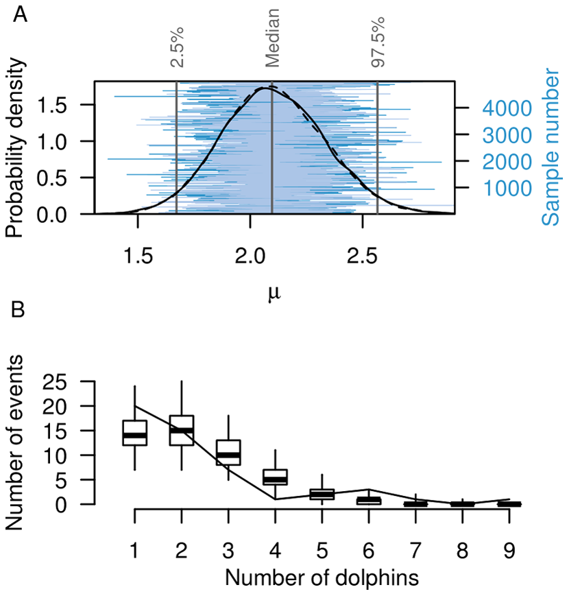
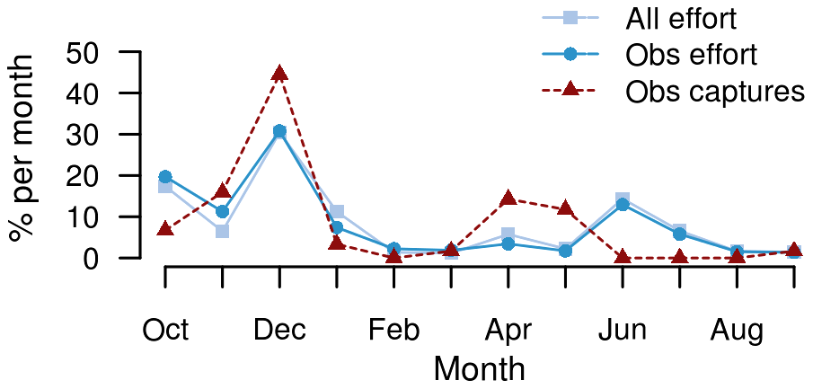
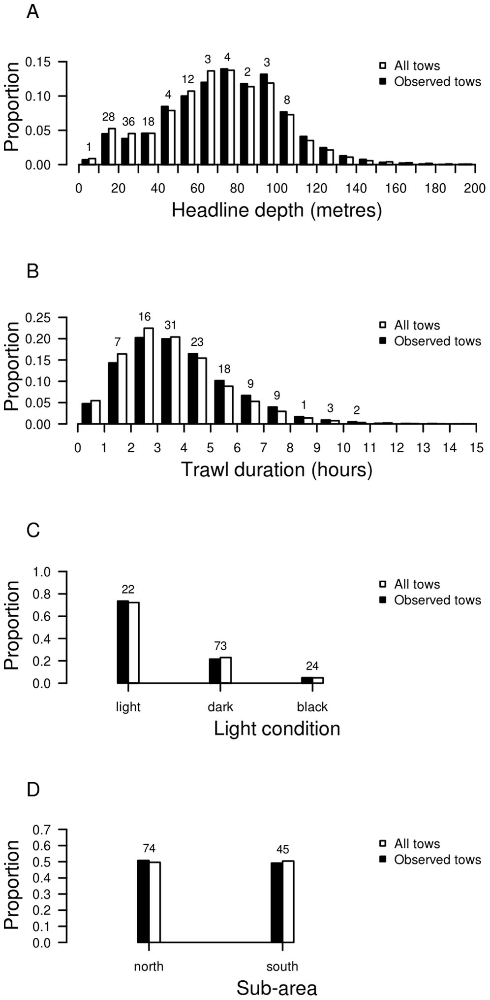
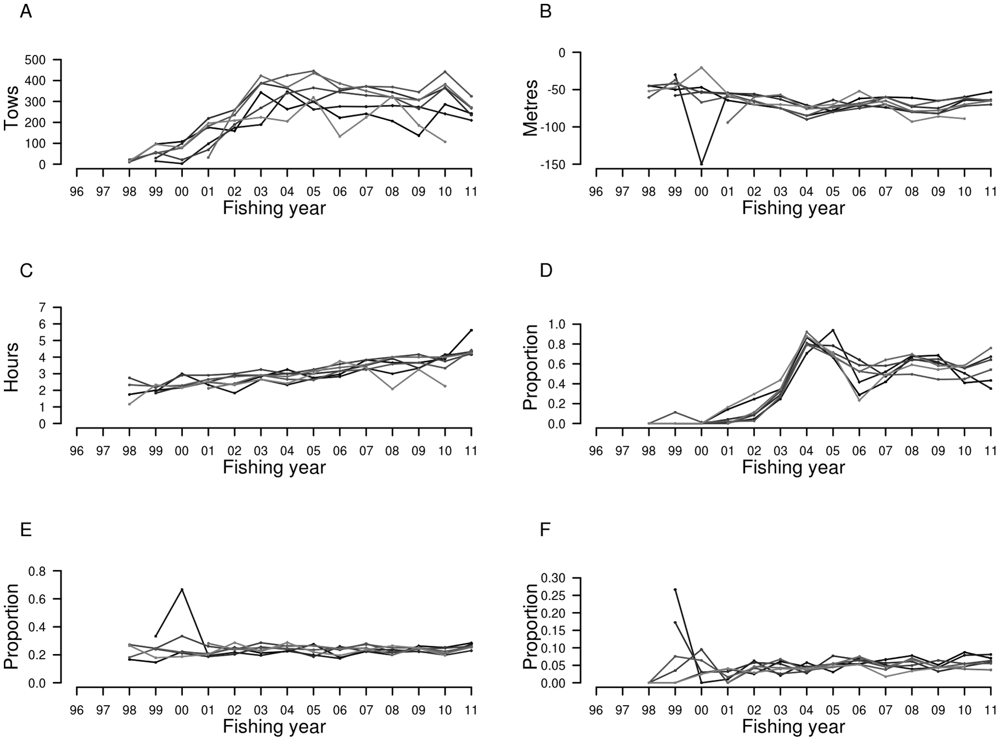

_This paper appears in the PLOS ONE journal [(link)]( http://www.plosone.org/article/info%3Adoi%2F10.1371%2Fjournal.pone.0064438)_

## Abstract:

Marine mammals are regularly reported as bycatch in commercial and artisanal
fisheries, but data are often insufficient to allow assessment of these
incidental mortalities. Observer coverage of the mackerel trawl fishery in New
Zealand waters between 1995 and 2011 allowed evaluation of common dolphin
_Delphinus delphis_ bycatch on the North Island west coast, where this species
is the most frequently caught cetacean. Observer data were used to develop a
statistical model to estimate total captures and explore covariates related to
captures. A two-stage Bayesian hurdle model was used, with a logistic
generalised linear model predicting whether any common dolphin captures
occurred on a given tow of the net, and a zero-truncated Poisson distribution
to estimate the number of dolphin captures, given that there was a capture
event. Over the 16-year study period, there were 119 common dolphin captures
reported on 4299 observed tows. Capture events frequently involved more than
one individual, with a maximum of nine common dolphin observed caught in a
single tow. There was a peak of 141 estimated common dolphin captures (95%
c.i.: 56 to 276; 6.27 captures per 100 tows) in 2002--03, following the marked
expansion in annual effort in this fishery to over 2000 tows. Subsequently, the
number of captures fluctuated although fishing effort remained relatively high.
Of the observed capture events, 60% were during trawls where the top of the net
(headline) was 40 m below the surface, and the model determined that this
covariate best explained common dolphin captures. Increasing headline depth by
21 m would halve the probability of a dolphin capture event on a tow. While
lack of abundance data prevents assessment of the impact of these mortalities
on the local common dolphin population, a clear recommendation from this study
is the increasing of headline depth to reduce common dolphin captures.

## Introduction

Direct interactions between fisheries and marine mammals frequently occur when
fishing operations overlap with the distribution of pinniped and cetacean
populations [@chuenpagdee_collateral_2003; @shaughnessy_review_2003;
@read_bycatch_2006]. In the majority of incidents, entanglement and entrapment
in fishing gear result in injury and mortality, and incidental captures of
marine mammals have been documented for a variety of fisheries worldwide
[@woodley_incidental_1991; @fertl_cetacean_1997; @hall_ecological_1998]. For
some marine mammal populations and species, these incidental captures pose a
serious threat [@dawson_management_2005; @reeves_global_2005;
@goldsworthy_risk_2007]. Cetaceans are particularly vulnerable to increased
mortalities as they have slow life histories and limited potential for
population increase [@read_interactions_2008].

A number of cetacean species are attracted to fishing vessels, and have been
observed to feed in association with trawlers [@chilvers_trawling_2001;
@rayment_observations_2009]. One species that features prominently in bycatch
reports across different fisheries and regions is short-beaked common dolphin
_Delphinus delphis_ Linnaeus, 1758 (hereafter referred to as "common dolphin")
[@northridge_estimation_1996; @tudela_driftnet_2005; @mannocci_assessing_2012;
@boer_interactions_2012]. This species is globally distributed in temperate,
subtropical and tropical regions, where it is often abundant in coastal waters
[@danil_growth_2007]. Common dolphin often form large aggregations (up to
several thousand individuals), including multi-species associations with other
cetaceans, such as pilot whale _Globicephala_ sp. and striped dolphin _Stenella
coeruleoalba_ [@frantzis_associations_2002; @stockin_thesis_2008;
@stockin_factors_2008]. Based on its global distribution and abundance, the
conservation status of common dolphin is "least concern"
[@hammond_delphinus_2008]. On a smaller spatial scale, however, there are
several separate populations that are in serious decline, such as in the
Mediterranean and Black seas [@reeves_dolphins_2003]. Furthermore, distinct
morphological differences indicate the existence of potential sub-species in
some regions, including the Black Sea [@hammond_delphinus_2008].

In New Zealand waters, common dolphin are present in coastal areas throughout
the country, with a number of recent studies focused on northern populations
[@brager_distribution_1998; @neumann_photo_2002; @meynier_stomach_2008;
@stockin_status_2009]. Although there are no population estimates for this
region, they are considered to be abundant, often forming schools of over a
hundred individuals [@stockin_factors_2008]. As has been documented for
populations elsewhere [@forney_distribution_2006], common dolphin in New
Zealand show differences in their distribution and habitat use
[@stockin_factors_2008]. While small groups of common dolphin are present
year-round in shallow waters (<20 m depth) in some regions
[@stockin_factors_2008], they generally exhibit seasonal inshore/offshore
movement, residing in coastal waters during spring and summer, before moving
further offshore during autumn [@neumann_seasonal_2001]. Their inshore/offshore
migration also occurs on a diel basis, which seems to correspond with the
exploitation of different food sources and the movement of prey
[@meynier_stomach_2008].

Common dolphin feed predominantly on epipelagic and pelagic species, such as
schooling fishes and squids [@ohizumi_stomach_1998; @pusineri_food_2007;
@rossman_estimated_2010]. In New Zealand waters, the diet of common dolphin
largely consists of jack mackerel (_Trachurus_ spp.), anchovy (_Engraulis
australis_), and arrow squid (_Nototodarus_ spp.)[@meynier_stomach_2008]. Their
prey preference makes common dolphin susceptible to trawl fisheries targeting
the same species [@morizur_incidental_1999]. The incidental capture of this
species has been documented for pelagic trawl fisheries across geographical
regions, including different parts of the Atlantic Ocean
[@waring_incidental_1990; @morizur_incidental_1999], the North Sea,
Mediterranean Sea, and Pacific Ocean (see review in [@fertl_cetacean_1997]).
The majority of records, however, are anecdotal or insufficient to allow a
systematic assessment of bycatch numbers and potential impacts for this (and
other) marine mammal species (but see for example, [@morizur_incidental_1999]).

In view of the scarcity of quantitative assessments, the present study was
aimed at estimating the number of common dolphin captured in commercial trawl
fisheries in New Zealand waters. A considerable proportion of common dolphin
are caught and killed by vessels targeting mackerel, including jack mackerel
(_Trachurus declivis_, _T. murphyi_, and _T. novaezelandiae_) or blue mackerel
(_Scomber australasicus_) [@stockin_status_2009]. This mackerel fishery is
concentrated on the west coast of New Zealand's North Island, and had
sufficient observer coverage to allow the development of a statistical model
for the estimation of total captures (including unobserved fishing effort)
based on observed trawls (or tows) and capture records. In addition to
obtaining total bycatch estimates, the modelling approach also allowed the
identification of factors that were associated with common dolphin captures.
 
## Methods

### Data sources

The statistical model built to estimate common dolphin captures was based on
fishing-effort and observer data for the 16-year period between 1 October 1995
and 30 September 2011 (the fishing year in New Zealand runs from 1 October to
30 September, and the data analysis and presentation followed this format).
Fishing data were obtained from records of trawler activity reported by
commercial fishers on effort return forms, including the date and time of trawl
effort, the position of the start and end of each trawl, the target species,
catch weight, and details of the fishing gear used. Incidental captures of
protected species were recorded by government observers on-board commercial
fishing vessels within New Zealand's Exclusive Economic Zone (EEZ). Observer
data included the identity of the species captured, and the time and location
of the captures and of every observed trawl.

Both fishing effort and observer records were prepared and linked, correcting
for errors in date, time, and position fields. Observer records were linked to
the fisher-reported effort data by comparing the start and end times, location,
and target species for each vessel. To accurately predict captures on the
unobserved trawls, it was necessary to develop the model with factors that were
available on the trawls that were not observed. This requirement limited
available data to those recorded by the fishers.

An area on the west coast of the North Island was used to select data for
modelling and analysis, as it included the mackerel fishery region where common
dolphin captures have been observed. This area was enclosed by a line extending
north along longitude 173° 2.8' E, a line across Cook Strait (between North and
South islands) at latitude 41° S, boundary at 171° E, and the boundary of New
Zealand's EEZ (Figure [#fig:pel-trip-effort]). To provide higher spatial
resolution, the area was divided into northern and southern sub-areas at
latitude 39° 18' S.

#### Figure: North Island commercial trawl map {#fig:pel-trip-effort}

{width=75%}

Caption: __Commercial trawl effort in the west coast North Island region, New
Zealand.__ Mean annual trawl effort (number of tows) of the commercial mackerel
(_Trachurus_ spp. and _Scomber australasicus_) fishery between 1 October 1995
and 30 September 2011, including locations of observed common dolphin
(_Delphinus delphis_) captures. Also indicated are the boundaries of the area
modelled for estimating common dolphin captures.)

### Common dolphin capture model

The large number of tows without captures in the observer data resulted in an
unbalanced data set owing to a disproportional high number of zeros. Three
different models structures were initially trialled to account for this high
number of zeros, including a negative-binomial model with overdispersion, a
zero-inflated Poisson model which allows extra zeros, and a hurdle model which
included a two-stage Bayesian model that separately predicts the probability of
capture events occurring and the number of captures on each capture event. The
latter model was chosen, as it was difficult to estimate the overdispersion
parameter in the negative-binomial model, and the likelihood that an observer
failed to report the capture events (alongside the likelihood of captures
occurring) in the zero-inflated model structure. The difficulties in estimating
these parameters increases the uncertainty in the resulting estimates, so that
the two-stage Bayesian model was the preferred model structure used here.
Models of this kind are called hurdle models [@mullahy_specification_1986;
@ridout_models_1998], and are appropriate when different processes are
influencing the occurrence of captures and the number of animals caught in each
capture event.

In the first stage, a logistic generalised linear model estimated the
probability of capturing common dolphin on a given tow as a linear function of
a number of covariates. Given that there was a capture event, the number of
captures was then estimated in the second stage by sampling from a
zero-truncated Poisson distribution. In addition to estimating total captures,
the model determined the relationship between covariates and common dolphin
captures.

The statistical model estimated the probability, ``\pi_i``, of capturing
dolphins on a tow, ``i``. A year effect, ``\lambda_j`` was estimated for each
year, ``j``, allowing for annual variation in the capture event rates that was
unrelated to the covariates, ``x_{ic}``. The contribution of each covariate,
indexed by ``c``, was governed by a regression coefficient, ``\beta_c``, that
was estimated by the model. The logit transform of the capture event
probability was defined as the sum of the year effect, ``\lambda_{j[i]}``, and
the covariates:

~~~math
#eq:logit_pi
\textrm{logit}(\pi_i) = \lambda_{j[i]} + \sum_c \beta_c x_{ic}.
~~~

Diffuse normal priors were given to the regression coefficients, ``\beta_c``,
and to the mean of the year effects, ``\lambda_j``. A half-Cauchy prior, with a
scale of 25, was given to the variance of the year effects. Uninformative
priors were given to all the parameters and hyper-parameters (following
recommendations from [@gelman_prior_2006]).

On tows where common dolphin captures occurred, the captures were assumed to
follow a zero-truncated Poisson distribution with size ``\mu``. The use of a
zero-truncated distribution reflected the structure of the hurdle model (if a
capture event occurred the number of dolphins caught must have been one or
more). The probability that ``y_i`` dolphins were captured on tow ``i`` was
given by

~~~math
\textrm{Pr}(y_i = y) &= \left\{
\begin{array}{l l}
(1 - \pi_i) & \quad \mbox{if} \quad y = 0 \\
\pi_i{ e^{-\mu}\mu^y \over (1-e^{-\mu})y!} & \quad\mbox{if} \quad y > 0 .\\
\end{array} \right.
~~~

The new size, ``\mu``, was given a prior that was uniform between 0.5 and 30.
It would be possible for the size of the truncated Poisson distribution,
``\mu``, to vary with the value of covariates on each tow. However, an initial
exploration suggested that there was no consistent variation of the size
``\mu`` with any available covariates.

Estimates were prepared for groups of tows, grouped by fishing year, ``y``, and
vessel, ``v``. The estimated total number of dolphins captured in a group,
``D^t_{yv}``, was calculated as the sum of actual reported captures on observed
tows, ``d^o_{yv}``, and estimated captures on the unobserved tows, ``D^e_{yv}``,

~~~math
#eq:total-estimate
D^t_{yv} = d^o_{yv} + D^e_{yv}.
~~~

Total captures in a year were obtained by summing the captures over all vessels
fishing in that year, ``D^t_y = \sum_v D^t_{yv}``.

The model was coded in the BUGS language [@spiegelhalter_winbugs_2003], a
domain-specific language for describing Bayesian models (please see
Supplemental Information for the BUGS code used). The model was fitted with the
software package JAGS [@plummer_jags_2005], using Markov chain Monte Carlo
(MCMC) methods. To ensure that the model had converged, a burn-in of 10~000
iterations was made. The model was subsequently run for another 100~000
iterations and every 20th iteration was kept. Two chains were fitted to the
model, and the output included 5000 samples of the posterior distribution from
each chain. Model convergence was assessed using diagnostics provided by the
CODA package for the R statistical system [@plummer_coda_2006]. To test whether
the model produced a suitable representation of the data, simulations of
observed captures were made using randomly chosen samples from the Markov
chains and visually compared with the observed captures [@gelman_data_2006]. A
comparison was made of the frequency distribution of the number of dolphins
caught during capture events, between the observed data and predictions from
samples from the Markov chains.

### Covariate selection

The model structure allowed for the dolphin capture event probability to depend
on covariates. A step analysis was used to identify the covariates that had
explanatory power [@venables_modern_2002]. Maximum likelihood methods were used
to fit a binomial generalised linear model to the observed capture events, trying different combinations of factors (see list of potential covariates in
Table [#tab:potential_covariates]). At each stage of the analysis, the model
was fitted repeatedly, with each of the covariates included (or removed) in
turn and selection of the covariate that produced the greatest reduction in the
Akaike Information Criterion [@akaike_information_1974]. Steps continued until
the deviance was not reduced by more than 1%. Placing a requirement on the
deviance reduction prevented the inclusion of covariates that had little
explanatory power. Catch weight, tow duration, night hours, bottom depth, and
fishing depth, were all included both directly and as a log-transform (with one
tonne and one hour added to catch weight and night hours, respectively, before
performing the transformation).

#### Table: potential covariates {#tab:potential_covariates}

-----------------------------------------------------------------------
Covariate        Description
------------     ------------------------------------------------------
Trawl speed             Fishing speed (knots) from the Trawl Catch Effort
                        Processing Return (TCEPR) data.

Trawl duration          The duration of tows (hours) from start and end times
                        recorded on TCEPR forms.

Fishing depth           The depth of the net ground line (metres).

Headline height         The height of the net opening (metres).

Headline depth          The depth of the top of the net (metres), derived by
                        subtracting the headline height from the ground line
                        depth (both recorded on TCEPR forms). Indicates the
                        depth of the top of the net.

Bottom depth            Minimum depth at either the start or end positions of
                        tows (metres), derived using ETOPO2v2 bathymetric data
                        [@smith_global_1997; @noaa_etopo2_2006].

Depth factor            Bottom depth as a factor, with tows in water less than
                        210 m defined as shallow, and other tows defined as
                        deep.

Catch weight            Total catch weight of each trawl (tonnes) as recorded
                        on the TCEPR forms.

Sub-area                The west coast North Island region divided into two
                        sub-areas (north and south of 39° 18' S) and each
                        included as a factor variable.

Light condition         A three-valued factor that classified tows according to
                        the time of the haul and the phase of the moon. The
                        three levels were set following initial exploration and
                        were: light (net hauled between dawn and dusk, or
                        between dusk and midnight on a moonlit night), dark
                        (net hauled between dusk and midnight on a dark night,
                        or between midnight and dawn on a moonlit night), and
                        black (net hauled between midnight and dawn on a dark
                        night). The illumination of the moon and time of dawn
                        and dusk were calculated using standard algorithms
                        [@meeus_astronomical_1991]. The night was
                        classified as moonlit if more than 17% of the moon's
                        disc was illuminated. Dawn and dusk were defined as
                        when the centre of the sun's disk was 6° below
                        the horizon (civil dawn and dusk).

Moon illumination       Fractional illumination (percentage) of the moon's
                        disc, calculated using standard algorithms
                        [@meeus_astronomical_1991].

Night hours             The number of night hours during a trawl, calculated as
                        the number of hours of the tow between civil dawn and
                        dusk.

Month                   Months of the year as a factor variable.

Season                  A grouping of months into quarters (January to March,
                        April to June, July to September, and October to
                        December), included as a factor variable.

Nation                  Factor indicating which flag each vessel was flying:
                        Russia, New Zealand, Japan, Korea, or FOC (a flag of
                        convenience).

-----------------------------------------------------------------------

Caption: __Potential covariates considered for inclusion in the model.__
Definition of variables that were included in the step analysis to select
covariates for estimating common dolphin _Delphinus delphis_ bycatch in a
commercial trawl fishery in New Zealand waters.

## Results

### Observed captures

Between 1995--96 and 2010--11, there were 135 observed common dolphin captures
in commercial trawl fisheries in New Zealand waters. The majority of observed
captures (119) were in the mackerel fishery operating on North Island's west
coast. All 119 observed captures occurred on vessels that were longer than
90 m. As a consequence, estimates of common dolphin captures were based on
observer data from vessels over 90 m length that targeted jack mackerel or blue
mackerel on at least one tow per fishing trip. These trips were defined as the
large-vessel mackerel fishery. Other observed marine mammal captures in this
fishery involved 11 pilot whales _Globicephala_ spp. and 16 New Zealand fur
seal _Arctocephalus forsteri_.

There was a total of 23~499 tows reported by the large-vessel mackerel fishery
over the 16-year study period (Table [#tab:dolphin-effort]). Over this time,
trawl effort was initially low, but increased substantially between 1999--00
and 2002--03 (Table [#tab:dolphin-effort]). Since then, fishing effort has
generally been around 2000 tows per year, with a decrease in trawl effort in
the most recent fishing year (2010--11), when 1551 tows were fished. Observer
coverage between 1995--96 and 2010--11 fluctuated considerably, between 7 and
70%, with at least 20% of all tows observed in most fishing years.

\initiateLandscape

#### Table: annual dolphin capture summary {#tab:dolphin-effort}

**Year** | **Effort** | **% obs.** | **Cap.** | **Events** | **Rate** | **Est. captures** |  | **Est. cap. rate** |   |
---------|-----|------|---|---|------|---|--------|------|---------------
|   | **Tows**   |        | **Dolphins** | **Tows** | **per 100 tows**  | Mean | 95% c.i.| Mean | 95% c.i.  |
1995--96 | 406 | 29.6 | 2 | 1 | 1.67 | 5 | 2 - 16 | 1.20 | 0.49  -  3.94 
1996--97 | 230 | 70.4 | 0 | 0 | 0.00 | 0 | 0 - 4 | 0.15 | 0.00  -  1.74 
1997--98 | 560 | 38.9 | 0 | 0 | 0.00 | 2 | 0 - 9 | 0.30 | 0.00  -  1.61 
1998--99 | 350 | 24.0 | 0 | 0 | 0.00 | 3 | 0 - 15 | 1.00 | 0.00  -  4.29 
1999--00 | 412 | 17.2 | 1 | 1 | 1.41 | 8 | 1 - 27 | 1.83 | 0.24  -  6.55 
2000--01 | 974 | 12.2 | 1 | 1 | 0.84 | 12 | 1 - 40 | 1.28 | 0.10  -  4.11 
2001--02 | 1577 | 7.0 | 1 | 1 | 0.90 | 31 | 3 - 90 | 1.97 | 0.19  -  5.71 
2002--03 | 2249 | 9.9 | 21 | 6 | 9.42 | 141 | 56 - 276 | 6.27 | 2.49  -  12.27 
2003--04 | 2309 | 7.1 | 17 | 7 | 10.37 | 108 | 47 - 204 | 4.67 | 2.03  -  8.83 
2004--05 | 2424 | 23.1 | 21 | 10 | 3.74 | 82 | 45 - 132 | 3.38 | 1.86  -  5.45 
2005--06 | 2117 | 30.6 | 2 | 1 | 0.31 | 13 | 2 - 34 | 0.60 | 0.09  -  1.61 
2006--07 | 2167 | 28.7 | 11 | 5 | 1.77 | 55 | 23 - 103 | 2.53 | 1.06  -  4.75 
2007--08 | 2164 | 34.0 | 20 | 5 | 2.72 | 44 | 25 - 74 | 2.04 | 1.16  -  3.42 
2008--09 | 1820 | 38.1 | 11 | 4 | 1.59 | 28 | 13 - 52 | 1.55 | 0.71  -  2.86 
2009--10 | 2189 | 30.1 | 4 | 2 | 0.61 | 30 | 7 - 68 | 1.36 | 0.32  -  3.11 
2010--11 | 1551 | 29.9 | 7 | 6 | 1.51 | 64 | 26 - 116 | 4.13 | 1.68  -  7.48 

Caption: __Annual summary of common dolphin *Delphinus delphis* captures in the west coast North Island region.__ Annual trawl effort, observer coverage, observed number of common dolphin captures, number of observed capture events, observed capture rate (dolphin per 100 tows), estimated
common dolphin captures, and the estimated capture rate (with 95\% confidence
intervals), in the west coast North Island/New Zealand mackerel trawl fishery.

\terminateLandscape

The 119 incidental captures of common dolphin occurred on 50 of the 2499
observed tows. All captures resulted in mortalities. Typically more than one
dolphin was caught per capture event, with two or three dolphins frequently
caught at the same time (Figure [#fig:mean-of-poisson]). A maximum of nine
individuals was caught in a single incident. There were 0.88 capture events per
100 tows, and an observed capture rate of 2.1 common dolphin per 100 tows
across the entire study period.

#### Figure: mean dolphis caught per capture {#fig:mean-of-poisson}

{width=60%}

Caption: __Number of common dolphin _Delphinus delphis_ caught per capture
event.__ **A** Posterior distribution of the size of the zero-truncated Poisson
distribution, ``\mu``, showing the probability density and trace of the two
chains. **B** Comparison of the predicted distribution of the number of common
dolphin caught per capture event between the observed captures (solid line) and
samples from the model posterior (boxplots indicating the median, quartiles,
and 95% confidence interval of the distributions).

The spatial distribution of trawl effort in the large-vessel mackerel fishery
extended along the North Island west coast, with a similar spatial extent in
observer coverage (Figure [#fig:pel-trip-effort]). Both fishing effort and
observer coverage were similar in both sub-areas, and observed common dolphin
captures occurred in shoreward zones of both sub-areas. Throughout the fishing
year, trawl effort was relatively high in October, and showed a marked peak in
December, with approximately 20% and 30% of fishing effort occurring in these
two months, respectively (Figure [#fig-dolphin-months]). Observer coverage
corresponded closely with the temporal pattern of fishing effort across months.
The number of observed dolphin captures was high in December, and showed
another, smaller peak in April and May, at a time when fishing effort was low.

#### Figure: monthly distribution of activity {#fig-dolphin-months}

{width=60%}

Caption: __Monthly distribution of fishing effort and common dolphin
(*Delphinus delphis*) captures.__ Total trawl effort, observed effort and
observed dolphin captures in the large-vessel mackerel fishery on the North
Island's west coast, New Zealand, across the 16-year study period between 1
October 1995 and 30 September 2011.

### Estimated common dolphin captures

Based on observer and effort data, the total number of common dolphin captures
in the large-vessel mackerel fishery was estimated (Table
[#tab:dolphin-effort]). Over the entire reporting period, the number of
estimated common dolphin captures peaked at 141 (95% c.i.: 56 to 276) in
2002--03, and remained relatively high (over 80 estimated common dolphin
captures per fishing year) in the two subsequent fishing years. These high
estimates were at a time when total fishing effort increased markedly between
1999--00 and 2002--03 from initially low levels. The increase in trawl effort
was accompanied by high numbers of estimated common dolphin captures. Since the
initial expansion period, the number of tows has generally remained high with
over 2000 tows per year, whereas estimated common dolphin captures have
fluctuated. In the preceding two fishing years, 2008--09 and 2009--10, there
were 28 (95% c.i.: 13 to 52) and 30 (95% c.i.: 7 to 68) estimated common
dolphin captures, respectively, with a corresponding annual trawl effort of
1820 and 2189 tows. In the 2010--11 fishing year, there were 64 (95% c.i.: 26
to 116) total estimated common dolphin captures in this fishery. This estimate
was the highest value since the 2004--05 fishing year, and higher than
estimated common dolphin captures in recent years. It was particularly high
considering the concomitant drop in fishing effort in 2010--11 to 1551 tows.
Trawl effort in this fishing year was low compared with previous years, and
similar to trawl effort in 2001--02, when the fishery was first expanding. The
total mean estimated number of captures for the 16-year period was 626 (95%
c.i.: 457 to 820).

The high number of estimated common dolphin captures in 2010--11 was reflected
in the estimated capture rate of 4.13 (95% c.i.: 1.68 to 7.48) common dolphin
per 100 tows. This estimated capture rate was higher than estimated capture
rates in the previous six fishing years, and one of the highest estimated
capture rates over the entire reporting period.

In addition to predicting the probability of capture events, the two-stage
Bayesian model also predicted the number of common dolphin caught per capture
event over the 16-year period. This second stage was important, as most capture
events involved multiple captures, most frequently two or three common dolphin,
with groups of up to nine individuals observed caught at the same time (Figure
[#fig:mean-of-poisson]). The posterior distribution of the size of the
zero-truncated Poisson distribution, ``\mu``, had an approximately normal
distribution, with a median value of 2.1 (95% c.i.: 1.7 to 2.6) common dolphin
per capture event.

Comparing observer data and model estimates of the number of common dolphin
caught per capture event showed that observer data were well represented by the
zero-truncated Poisson distribution (Figure [#fig:mean-of-poisson]). All
observations were within the 95% confidence intervals of the model estimates,
except for the single incident involving the capture of nine dolphins, which
was less likely to occur in the model. The 2010--11 fishing year was unusual in
that most observed capture events involved individual common dolphin, with only
one incident involving the simultaneous capture of two dolphins.

### Model covariates

Selection of potential factors that may explain common dolphin captures
confirmed the importance of the four covariates headline depth, tow duration,
light condition, and sub-area. Headline depth had the highest explanatory
power, followed by tow duration; the other two covariates had considerably less
explanatory power. Light condition was included as a three-level factor and,
dependent on the time of the haul and the phase of the moon, defined as light,
dark, and black light conditions. Based on this analysis, these four covariates
were included in the Bayesian model.

Comparison of the observed and modelled data sets showed that the distributions
of the selected covariates were representative of overall fishing effort
(Figure [#fig:covariate_distributions]). Furthermore, observed common
dolphin captures were closely associated with the four covariates. For headline
depth, the highest number of observed captures was associated with headline
depths between 10 and 40 m, with 83 (70%) of the total 119 observed captures
involving tows at headline depths of less than 40 m. There were no observed
common dolphin captures at headline depths exceeding 110 m. Tow duration was
also an important covariate, and the majority of observed captures (88
captures, 73%) occurred on tows that were between 2 and 6 h in duration. Light
condition also influenced common dolphin captures, with dark and black light
conditions associated with 95 (80%) observed captures. For the spatial
distribution, there was a prevalence of common dolphin captures in the northern
sub-area, with 74 (62%) observed captures occurring in this sub-area.

#### Figure: convariance examples {#fig:covariate_distributions}

{width=60%}

Caption: __Distribution of selected covariates for the period between 1 October
1995 and 30 September 2011.__ **A** Headline depth, **B** tow duration, **C**
light condition, and **D** sub-area. The covariates were identified as
explanatory factors of common dolphin (_Delphinus delphis_) captures in the
large-vessel mackerel trawl fishery off the North Island west coast, New
Zealand. Total observed common dolphin captures are indicated above the bars.

The associated regression coefficients from the model fit were used to quantify
the influence of the covariates on the probability of common dolphin captures
(Table [#tab:beta-contributions]). Headline depth had a negative correlation
with a mean coefficient of -0.033 m^-1^, indicating that increasing the
headline depth would decrease the probability of a common dolphin capture
event. An increase in headline depth by 21 metres would halve this probability.
Tow duration was positively correlated with captures, indicating that a
decrease in tow duration would decrease the probability of a capture event.
Light conditions also influenced the capture event probability, with tows
hauled in the light having a mean capture event probability of 0.177 relative
to tows hauled in the dark. Tows hauled in black light conditions (i.e.,
between midnight and dawn on a dark night) had a similar capture event
probability (mean 1.078) to tows hauled in the dark.

#### Table: beta contributions {#tab:beta-contributions}

Covariate  |  Mean  | 2.5% | 50% | 97.5%
:----------|:------:|:------:|:-----:|:-------:
Headline depth, ``\beta_{headline}`` | -0.033 | -0.045 | -0.033 | -0.022
Log tow duration, ``\beta_{duration}`` | 1.470 | 0.700 | 1.462 | 2.285
Light condition, light (relative to dark), ``\exp(\beta_{light})`` | 0.177 | 0.075 | 0.166 | 0.346
Light condition, black (relative to dark), ``\exp(\beta_{black})`` | 1.078 | 0.421 | 1.000 | 2.139
Sub-area, south (relative to north), ``\exp(\beta_{south})`` | 0.539 | 0.246 | 0.510 | 0.996

Caption: __Summary of the covariate regression coefficients.__ Covariate
regression coefficients presented as mean, and the 2.5%, 50%, and 97.5%
quantiles of the posterior distributions. The coefficients of the discrete
factors have been exponentiated, so that they are multiplicative, with a value
of 1 indicating no effect.

Comparing the two sub-areas, tows in the southern sub-area had about half the
capture event probability to those in the northern sub-area, indicated by the
mean coefficient of 0.539.

### The mackerel fleet

There were 15 large vessels operating in the North Island west coast mackerel
fishery, with seven vessels accounting for over 95% of the fishing effort in
the 16-year period. In general, the mackerel fishery was conducted in a
coherent fleet, with main fishing characteristics shared across the seven
vessels (Figure [#fig:seven-vessel-characteristics]). Changes in the
covariates such as headline depth and light condition occurred at the same time
across vessels.

#### Figure: mackerel fleet survey {#fig:seven-vessel-characteristics}

Caption: __Annual trends of fishing characteristics (covariates) for each of
the seven main mackerel trawl vessels.__ **A** Trawl effort, **B** median
headline depth, **C** tow duration, **D** proportion of tows in the north,
**E** proportion of tows in dark light conditions, and **F** proportion of tows
in black light conditions, for fishing years between 1 October 1995 and 30
September 2011.

Both trawl effort and tow duration showed an overall increase over the
reporting period, with some fluctuations in recent years. Trawl effort declined
in 2010--11, following a marked increase the previous year. The decrease in
fishing effort in 2010--11 was partly caused by one vessel not participating in
this fishery, and also by the remaining vessels fishing less this year.
Headline depth showed relatively little variation throughout the study period,
and median values have remained below 50 m depth since 2001--02. There was a
marked shift to the northern sub-area in 2003--04, with a subsequent return to
the southern sub-area in 2005--06. Since 2007--08, the spatial distribution of
trawl effort has been relatively even between both sub-areas. Regarding trawl
effort in relation to light conditions, the proportions of tows conducted in
dark and in black light conditions were also uniform across vessels.
Approximately 20% of tows were conducted in dark light conditions, when the net
was being hauled between dusk and midnight on a dark night, or between midnight
and dawn on a moonlit night. This proportion has remained constant since
2001--02. In comparison, approximately 5% of tows were hauled in black light
conditions, with the net being hauled between midnight and dawn on a dark night.

The consistent variation in the covariates across vessels indicated that this
fishery was organised into a coherent fleet. Although a specific vessel effect
was initially included in the model, it was not significant, and there was no
evidence to suggest that particular vessels were better or worse in avoiding
common dolphin bycatch.

## Discussion

Between 1995 and 2011, common dolphin captures in the mackerel fishery occurred
in most fishing years. All 119 observed captures involved vessels >90 m length,
with 15 vessels falling within this category. Nine of these large vessels had
an observer on board at least once between 1 October 1995 and 30 September
2011. The two-stage hurdle model, developed to predict the occurrence of any
common dolphin capture on a given tow, and the number of dolphin captures per
tow (given that there were some captures), fit the data well, and provided
plausible estimates when used to predict captures on observed tows.

### Estimated captures

Common dolphin are frequently caught in trawl fisheries worldwide
[@fertl_cetacean_1997], but few studies include sufficient data to estimate
capture rates for an entire region or fishery, or to examine temporal trends.
As a consequence, previously reported capture rates are generally based on
relatively short-term observer data (i.e., 1-2 fishing seasons or <3 fishing
years), which are pooled over the entire study period to derive a single
capture rate for the fishery. Common dolphin capture rates documented in other
trawl fisheries are similar to the higher capture rates reported here. In
pelagic trawl fisheries for hake (_Merluccius merluccius_) and sea bass
(_Dicentrachus labrax_) in the northeastern Atlantic Ocean, observed capture
rates were 7.69 and 10.00 common dolphin per 100 tows, respectively
[@morizur_incidental_1999]; in the blue whiting (_Micromesistius poutassou_)
pair-trawl fishery in the eastern Atlantic Ocean, 8.37 common dolphin were
captured per 100 tows [@fernandez_incidental_2010]. Capture rates in the
Atlantic Ocean trawl fishery for large pelagic species (e.g., tuna and
swordfish) were 6.0 common dolphin per 100 tows [@northridge_estimation_1996].

Over the study period, common dolphin captures in New Zealand waters showed
some variation, even though fishing effort has remained relatively high (>1500
tows per year) since 2002--03. The reasons for the fluctuation in estimated
common dolphin captures are unknown, but are possibly related to changes in the
number of common dolphin in the fishing region. Capture rates are expected to
vary from year to year if the dolphin distribution varies significantly over
the same period in relation to the fishery [@northridge_estimation_1996]. Off
the coast of California, United States, common dolphin show significant changes
in abundance owing to seasonal and inter-annual shifts in distribution
[@forney_distribution_2006]. Common dolphin in New Zealand also show
differences in their distribution and habitat use, as they exhibit seasonal
inshore-offshore movement, residing in coastal waters during spring and summer,
before moving further offshore during autumn [@neumann_seasonal_2001]. This
seasonal migration has been related to changes in sea surface temperature
influencing the distribution of their prey species, which in turn may determine
the seasonal movement of common dolphin. The distribution of prey has also been
implicated in the inshore-offshore migration of common dolphin that occurs on a
diel basis, which seems to correspond with the exploitation of different food
sources and the movement of prey [@meynier_stomach_2008].

As there are no population data available for common dolphin in New Zealand
waters [@stockin_thesis_2008], and no abundance estimates for this region, it
is impossible to establish whether lower estimated capture rates are related to
fluctuations in common dolphin abundance at particular fishing locations.
Another potential reason for the variation in estimated capture rates could be
a change in the vulnerability of this species to being captured in the mackerel
fishery. Common dolphin may associate with fishing trawlers to a lesser extent
or may become more adept at avoiding captures, as has been proposed for other
marine mammals that are able to enter and exit nets without getting caught
(e.g., fur seals, [@lyle_fur_2008]).

Fisheries observers in New Zealand record common dolphin sightings, but these
data have not yet been collated. Future assessment of observer records of
common dolphin sightings may provide clarification whether the decrease in
common dolphin captures is related to the number of common dolphin visiting
fishing vessels.

Modelling of the entire 16-year data set removed the potential influence of
sample size in the present study, but variation in capture estimates in
previous studies has been attributed to differences in sample sizes across
fishing years, such as the number of tows fished in relation to observer
coverage. Substantial deviations in estimated common dolphin capture rates for
some years were attributed to small sample sizes rather than actual changes in
catch rates in an Atlantic Ocean pelagic pair-trawl fishery
[@northridge_estimation_1996]. Capture rates in years with limited sampling
effort were conspicuously different to those in other years, prompting the
pooling of annual data into a single common dolphin capture rate for the study
period [@northridge_estimation_1996]. Discrepancies between fishing effort and
incidental captures of common dolphin were also observed in other trawl
fisheries off the United States east coast [@waring_incidental_1990]. Involving
foreign vessels from different European countries, these fisheries primarily
target squid (_Loligo pealei_ and _Illex illecebrosus_) and Atlantic mackerel
(_Scomber scombrus_), using off-bottom (high-opening) and pelagic trawls.
Assessment of observed incidental captures in relation to fishing effort (days
fished) revealed distinct differences in capture rates between countries. For
example, Dutch fishing vessels consistently captured up to 10-fold more
cetaceans (common dolphin and pilot whale _Globiocephala_ spp.) than vessels of
the former German Democratic Republic, even though the latter fished a
significantly higher number (2--4 times) of days. These differences in capture
rates appeared to be related to differences in fishing strategies, such as gear
configuration, type of trawl and haulback speed, rather than total fishing
effort, but data were insufficient to evaluate this aspect
[@waring_incidental_1990].

In the current study, the majority of capture events involved groups of common
dolphin, most frequently two to three individuals, with up to nine individuals
caught in a single tow. This finding is comparable to observations in other
trawl fisheries, which frequently report multiple capture events for this
dolphin species. Observer data from different trawl fisheries in the northeast
Atlantic Ocean show common dolphin bycatch dominated by groups of two to four
individuals [@morizur_incidental_1999]. Similarly, pair-trawlers off the
Spanish coast mostly caught groups of two to four individuals, with seven and
15 common dolphin involved in one-off multiple capture events
[@fernandez_incidental_2010]. These data confirm that multiple capture events
of common dolphin are prevalent in trawl fisheries. Common dolphin frequently
form large groups and may also be attracted to fishing vessels, as at-sea
survey data of interactions between common dolphin and pelagic pair-trawlers
off south-western England suggest [@boer_interactions_2012]. Both the relative
abundance of common dolphin and the average group size were greater where
trawlers were operating compared with areas where trawlers were absent.

### Headline depth and other covariates

In the present study, detailed data analysis identified the role of four
covariates -- headline depth, light condition, sub-area and tow duration -- in
relation to common dolphin captures. The decrease in capture rates in recent
fishing years was not associated with a systematic change in any of these
covariates. Headline depth (the distance of the headline below the surface) was
the covariate that best explained the occurrence of common dolphin captures.
Other proxies for tow depth that were considered as covariates were bottom
depth, ground-line depth and the height of the net opening, but headline depth
had the highest explanatory power. The model estimated that increasing headline
depth on a tow by about 21 m would halve the probability of a common dolphin
capture occurring. The strong influence of headline depth was also evident in
the observer data; 60% of observed capture events, and 70% of common dolphin
captured in the large-vessel mackerel fishery occurred on the 14% of observed
tows that had a headline depth of less than 40 m. Both the model and observer
data suggest that restricting tows with shallow sets would reduce common
dolphin bycatch.

Furthermore, across all effort data, 69% of shallow tows (headline depth < 40m)
occurred at night. This preference for shallow fishing appears to be related to
the prevalence of mackerel in surface waters at night. Diel changes in the
behaviour of mackerel have been documented off the coast of Chile
[@bertrand_diel_2004], where mackerel migrate to the surface during the night
and form feeding aggregations. In contrast, they are deeper and more dispersed
during the day. Fishing followed this diel movement and headline depth was
typically shallower at night coinciding with dark or black light conditions. A
similar relationship between common dolphin captures and diurnal movement of
prey has been suggested for squid fisheries in the Atlantic Ocean
[@waring_incidental_1990]. The upward movement and concentration of squid at
the surface seem to concentrate feeding dolphins in surface waters, resulting
in the observed higher number of dolphins caught at night (2000--0400h). In
addition, if dolphins feed predominantly at night, the likelihood of dolphin
captures during the day would be further decreased, as it would spatially
separate them from squid during daylight hours [@waring_incidental_1990]. Apart
from following the diurnal surface migration of prey, dolphins may also feed
and scavenge around trawlers at night-time to reduce competition with other
scavenging species such as seabirds [@morizur_incidental_1999].

An increased catch of dolphins at night has also been noted in other pelagic
trawl fisheries [@crespo_direct_1997; @morizur_incidental_1999;
@fernandez_incidental_2010; @boer_interactions_2012]. Furthermore, light was
identified as a factor associated with common dolphin captures in a previous
analysis of the New Zealand mackerel trawl fishery, although tow depth was also
implicated [@fresne_factors_2007]. These studies, however, did not directly
investigate the role of headline depth in relation to common dolphin captures,
precluding direct comparisons with the findings here. Because of the
correlation between headline depth and time of day, the light condition factor
only explained a relatively small fraction of the residual deviance. The model
showed (Table [#tab:beta-contributions]) that the dolphin capture rate was
lower for fishing with hauls made in the day or on moonlit nights than at night
(a median ratio of 0.17 with a 95% c.i, of 0.08 to 0.35). However, the dolphin
capture rate was not significantly different when the haul was between midnight
and dawn on dark nights (a median capture rate ratio of 1.00 with a 95% c.i. of
0.42 to 2.14).

### Other fisheries

In addition to incidental captures in pelagic trawl fisheries, common dolphin
are also caught in inshore fisheries [@abraham_summary_98-08;
@mangel_artisanal_2010]. For example, in inshore (gillnet and longline)
fisheries in northern Peru, common dolphin (predominantly _Delphinus capensis_)
were the most commonly observed delphinid captured between 2005 and 2007,
constituting 47% of all incidental takes [@mangel_artisanal_2010]. There have
also been reported incidental captures of common dolphin in inshore trawl
fisheries in New Zealand [@abraham_summary_98-08], but these and other inshore
fisheries remain largely unobserved. For example, observer records of inshore
trawl fisheries in south-western New Zealand include nine observed common
dolphin captures in 2008--09, but these fisheries have not been observed at any
other time. Similarly, there has been little (less than 1%) observer coverage
of inshore set-net and trawl fisheries operating on the North Island west
coast. Inshore fisheries are of concern, as they often overlap with the
frequent occurrence of dolphins in shallow coastal waters (e.g., Hector's
dolphin _Cephalorhynchus hectori_, [@rayment_observations_2009]; vaquita
_Phocoena sinus_ [@dagrosa_bycatch_2000]). Common dolphin in New Zealand waters
have been shown to favour inshore waters during spring and summer, and also
during warmer La Niña conditions [@neumann_seasonal_2001]. The reason for
this prevalence appears to be the movement of prey, mainly kahawai (_Arripis
trutta_) and jack mackerel, linked to variation in sea surface temperature
[@neumann_seasonal_2001]. In addition, examination of common dolphin diet
suggests also diel inshore/offshore movement of this species, including the
jack mackerel fishing area [@meynier_stomach_2008]. The frequent occurrence of
common dolphin in coastal waters makes them vulnerable to inshore fisheries,
but scarcity of observer data precludes quantification of incidental captures
in this fishing sector.

## Conclusions

Common dolphin are globally distributed, with the population estimated to be in
the millions, and a conservation status of "least concern"
[@hammond_delphinus_2008]. Although fishery impacts are not considered a
concern at the global population level, they have been found to affect common
dolphin populations in particular regions. Common dolphin in the Mediterranean
Sea experienced a 50% decline in abundance over three generations, so that
their status has recently been listed as "endangered"
[@bearzi_overfishing_2008]. In the United States Atlantic Exclusive Economic
Zone, fisheries-related mortalities (across all types of fisheries combined)
between 1995 and 1999 exceeded the Potential Biological Removal value of this
species [@waring_stock_2001]. The Potential Biological Removal indicates how
many individuals can be removed annually without preventing a population (or
stock) to reach or maintain its optimal sustainable population levels
[@wade_calculating_1998]. A recent assessment of dolphin bycatch on the United
States east coast estimated that 14% of the Potential Biological Removal level
of this species were captured in the bottom trawl fishery only, with other
dolphin species also affected [@rossman_estimated_2010].

Common dolphin in New Zealand are considered "not threatened", even though
there are no population estimates for this region [@stockin_status_2009;
@baker_marinemammals_2010]. It is unknown whether the west coast North Island
population is resident or migratory. While the use of observer data in the
present study allowed the development of a statistical model to estimate common
dolphin captures in the mackerel fishing region over a 16-year period, the lack
of abundance data prevents the assessment of population level impacts of
incidental captures in New Zealand waters. In view of the importance of
headline depth, it is recommended that nets are towed at headline depths >40 m
to reduce the probability of incidental captures of common dolphin.

## Supporting Information

- [BUGS
  code](http://figshare.com/articles/Common_Dolphin_Delphinus_delphis_Bycatch_in
  _New_Zealand_Commercial_Trawl_Fisheries/706127) used for the two-stage
  Bayesian hurdle model to estimate total common dolphin (_Delphinus delphis_)
  captures in New Zealand commercial trawl fisheries between 1995 and 2011.

## Acknowledgments

This study was dependent on the many observers of the New Zealand Ministry for
Primary Industries Observer Programme who collected the data, and this effort
is gratefully acknowledged. Thanks are also due to the Ministry for Primary
Industries (MPI) and National Institute of Water and Atmopsheric Research
(NIWA) database teams who supplied the data and handled our questions and
queries. We also appreciate continued input from Ministry for Primary
Industries staff and from members of the Aquatic Environment Working Group. We
are especially grateful to Igor Debski of the New Zealand Department of
Conservation for his interest and useful feedback. We are also grateful to
Stephanie Rowe of the Department of Conservation and Anton van Helden of Museum
of New Zealand Te Papa Tongarewa for help identifying dolphins.

## References
